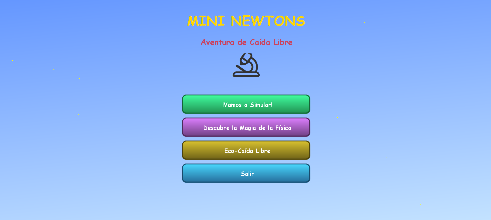
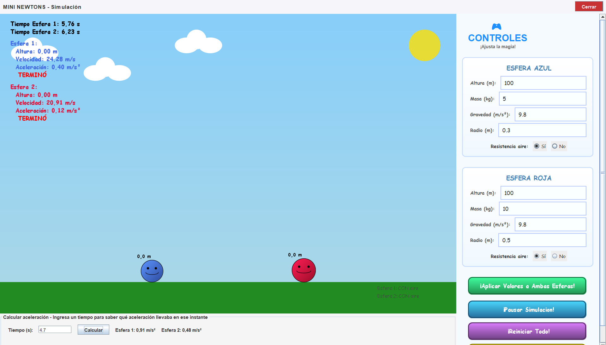
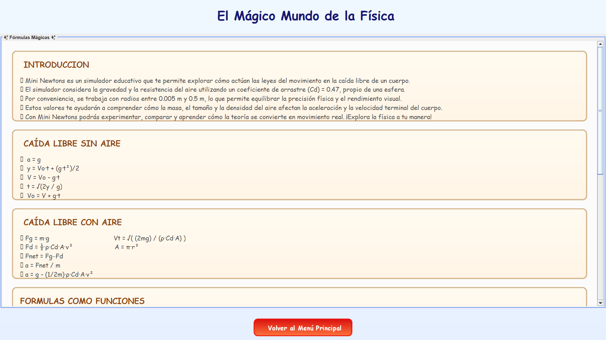
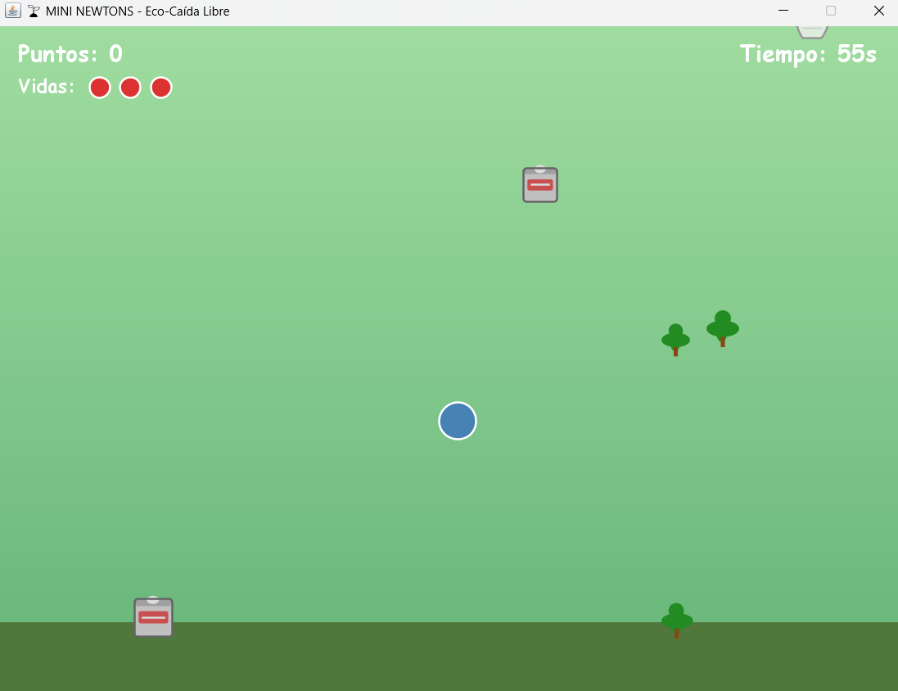

#  Mini Newtons — Aventura de Caída Libre
 
**Mini Newtons** es un simulador interactivo de caída libre desarrollado en **Java (Swing)**, creado como proyecto universitario con un objetivo pedagógico: acercar a niños y niñas al mundo de la física de una forma visual, colorida y divertida, permitiéndoles experimentar en tiempo real cómo distintas variables afectan la caída de un objeto.
 
##  Motivación
 
El proyecto nace con la idea de que aprender física no tiene que ser intimidante. En lugar de fórmulas frías en una pizarra, Mini Newtons convierte la Segunda Ley de Newton y la resistencia del aire en un "laboratorio de juguete" donde el usuario puede tocar, cambiar y ver el resultado inmediatamente. Desarrollado en el semestre 2025-2.
 
##  Vista previa

 
| Menú principal | Simulación en curso |
|---|---|
|  |  |
 
| Ventana de fórmulas | Modo Eco-Caída Libre |
|---|---|
|  |  |
 
##  Características principales
 
- **Simulación de caída libre en tiempo real** con animación gráfica de dos esferas comparables simultáneamente.
- **Variables ajustables por esfera:**
  - Masa
  - Radio
  - Altura inicial
  - Gravedad
  - Resistencia del aire (activable/desactivable)
- **Modo comparativo:** permite lanzar dos esferas con configuraciones distintas y observar las diferencias en tiempo real.
- **Panel de gráficas:** visualización de velocidad y aceleración a lo largo del tiempo.
- **Ventana de fórmulas:** explica de forma visual las ecuaciones físicas detrás de la simulación.
- **Modo "Eco-Caída Libre":** un modo alternativo tipo minijuego, pensado para reforzar el aprendizaje de forma lúdica.
- Interfaz colorida y amigable, pensada para un público infantil.
##  Modelo físico
 
El simulador aplica la Segunda Ley de Newton (F = m·a) para calcular la aceleración en cada instante:
 
- **Sin resistencia del aire:** `a = -g`
- **Con resistencia del aire (arrastre cuadrático):**
  - Fuerza de arrastre: `F_arrastre = 0.5 · ρ_aire · Cd · A · v²`
  - Fuerza neta: `F_neta = F_gravedad - F_arrastre`
  - Aceleración resultante: `a = F_neta / m`
Donde `ρ_aire` es la densidad del aire, `Cd` el coeficiente de arrastre, `A` el área frontal de la esfera (`π·r²`) y `v` la velocidad actual. La posición y velocidad se actualizan mediante integración numérica simple en cada paso de tiempo.
 
##  Tecnologías
 
- **Lenguaje:** Java
- **Interfaz gráfica:** Java Swing / AWT (sin dependencias externas)
- **IDE recomendado:** IntelliJ IDEA
##  Requisitos
 
- JDK 17 o superior (no se usan librerías externas, solo la biblioteca estándar de Java)

 
##  Autores
 
Proyecto desarrollado como trabajo personal y universitario en el marco de un curso de Ingeniería de Sistemas.
- Daniel Castañeda Londoño
- Juan Pablo Osorio Galvis
- Juan Esteban Cardona Marin    https://github.com/juancardona16-art 
- Juan David Zuñiga Zuñiga
 
## ⚠️ Uso y derechos
 
Este es un **proyecto personal y académico**, compartido públicamente solo con fines de portafolio y consulta.
 
No se otorga autorización para:
- Usar este proyecto, su código o partes de él con **fines comerciales o de lucro**.
- Redistribuirlo, modificarlo o presentarlo como propio (por ejemplo, en otros trabajos académicos) sin el permiso explícito del autor.
Si quieres usar este proyecto como referencia, aprender de él, o reutilizar partes con fines educativos personales, siéntete libre de consultarlo — pero cualquier otro uso requiere autorización previa del autor.
 
Todos los derechos sobre el código y el diseño del proyecto son del autor.
